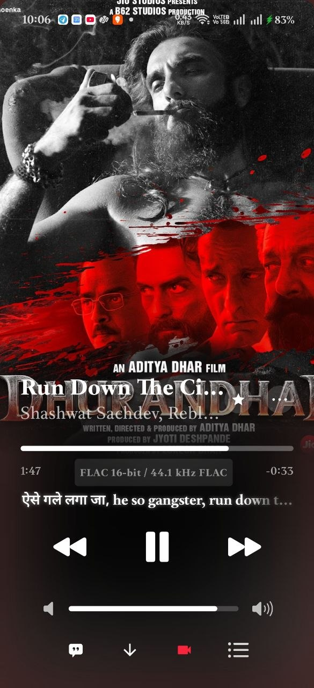
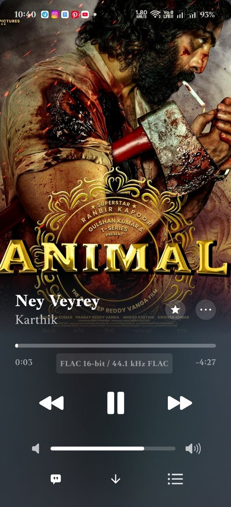
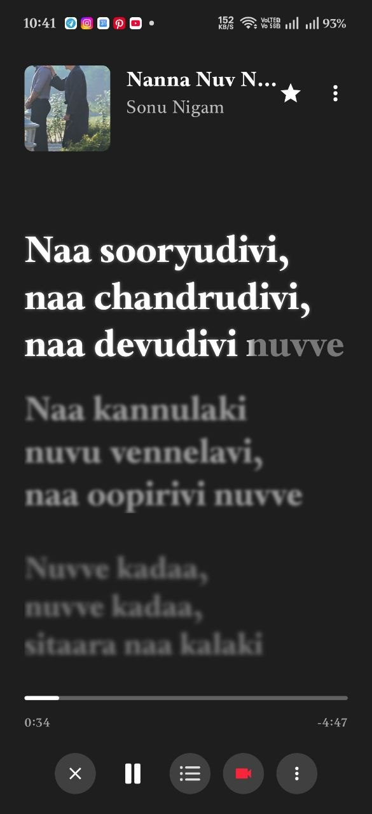
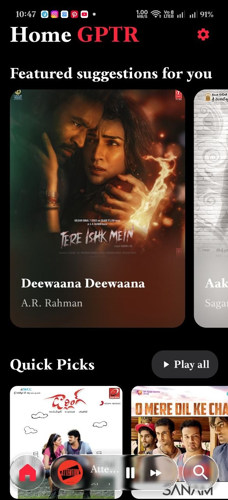

<p align="center">
  
</p>

<h1 align="center">🎵 GPTR Music</h1>

<p align="center">
  <b>Redefining the YouTube Music Experience on Android</b><br>
  <i>High-performance, privacy-focused, and packed with features for people who truly care about their music experience.</i>
</p>

<p align="center">
  <a href="#-features">Features</a> •
  <a href="#-screenshots">Screenshots</a> •
  <a href="#-download">Download</a> •
  <a href="#-tech-stack">Tech Stack</a> •
  <a href="#-support">Support</a>
</p>

<p align="center">
  
  
  
  
</p>

<p align="center">
  
  
  
  
</p>

<p align="center">
  <a href="https://t.me/gptrmusic">
    
  </a>
  <a href="https://x.com/gandretiraghu">
    
  </a>
</p>

---

## 📱 About

**GPTR Music** is not just another generic YouTube Music client for Android. It's a custom-built music player developed from scratch for music enthusiasts who value **privacy**, **extreme performance**, and a **stunning visual aesthetic**.

The app features a revolutionary **Liquid Glass** UI engine that processes album artwork in real-time to generate immersive blurs, 1D stretched reflections, and fluid translucent gradients that tint the entire interface. The app chromatically blends with the currently playing song, creating a truly premium atmosphere.

### Why GPTR Music?

- 🔒 **Zero Telemetry** — No trackers, no analytics, no data collection
- ⚡ **Instant Startup** — Intelligent caching eliminates loading screens
- 🎨 **Liquid Glass UI** — Dynamic visual engine that adapts to your music
- 🎧 **Professional Audio** — Custom equalizer with Dolby & Dirac presets
- 📶 **Works Offline** — Download songs for offline playback
- 🎤 **Song Recognition** — Shazam-like identify any song around you
- 🌐 **Multi-language** — Spanish & English interface

---

## 📸 Screenshots

<p align="center">
  
  
  
  
</p>

---

## 🎬 Video Demos

> 📹 Check out GPTR Music in action! Open an issue or visit our [Telegram](https://t.me/gptrmusic) for video demos.

---

## ✨ Features

### 🎵 Music Playback
| Feature | Description |
|---------|-------------|
| **YouTube Music Streaming** | Stream millions of songs via YouTube Music backend |
| **Local File Playback** | Play music stored on your device |
| **Background Playback** | Keep listening with the screen off via foreground service |
| **Media Notification** | Full playback controls in notification & lock screen |
| **Shuffle & Repeat** | Shuffle mode + Repeat Off / Repeat One / Repeat All |
| **Crossfade** | Smooth transitions between songs (1–5 seconds configurable) |
| **Sleep Timer** | Auto-stop playback after 15, 30, 45, 60, or 90 minutes |

### 🎨 Liquid Glass UI Engine
| Feature | Description |
|---------|-------------|
| **Dynamic Color Extraction** | Extracts dominant colors from album artwork in real-time |
| **Glass Morphism** | Translucent navigation bars, buttons, and mini-player |
| **1D Stretched Pixel Reflection** | Premium pixel-stretch effect that blends cards with backgrounds |
| **Two Glass Styles** | Transparent & Semitransparent modes |
| **HD Artwork** | Automatic resolution upgrade to 1200×1200 for album covers |
| **Animated Album Art** | Apple Music animated artwork + Spotify Canvas video support |

### 🎤 Lyrics (Multi-Provider System)
| Feature | Description |
|---------|-------------|
| **Synced Lyrics** | Real-time synchronized lyrics scrolling with the music |
| **8+ Providers** | Spotify, Apple Music, NetEase, LRCLIB, KuGou, BetterLyrics, YouTube Music, and more |
| **Auto Best Quality** | Automatically selects word-synced > line-synced > plain text |
| **Smart Matching** | Vivi-style scoring with duration, title, and artist similarity |
| **Romaji Transliteration** | Japanese/Asian lyrics converted to romaji for easy reading |
| **Manual Lyrics Editor** | Edit and sync lyrics yourself |
| **Glow Styles** | Album Color, Rainbow, Neon, and Pulsing glow effects |
| **Manual Search** | Search lyrics with custom title/artist query |

### 📻 Music Recognition (Radio)
| Feature | Description |
|---------|-------------|
| **Shazam-like Identification** | Tap to identify any song playing around you |
| **Fast Recognition** | 4.2-second audio sample + signature matching |
| **Auto-Search** | Recognized songs automatically search in the app |
| **Visual Feedback** | Animated pulse ring while listening |

### 🏠 Home Screen
| Feature | Description |
|---------|-------------|
| **Personalized Recommendations** | Quick Picks based on your listening history |
| **Keep Listening** | Resume recently played songs |
| **Similar Artists** | Discover music similar to artists you love |
| **Featured Playlists** | Curated playlists carousel |
| **Smart Algorithm** | 8 diverse seeds from top 30 recently played for varied recommendations |
| **Instant Loading** | Persistent cache = no loading screens ever |

### 🆕 New Releases (Novedades)
| Feature | Description |
|---------|-------------|
| **Featured Albums Carousel** | Auto-scrolling showcase of new albums |
| **New Albums Grid** | Browse newly released albums |
| **Featured Songs** | Fresh tracks from real artists |
| **Trending Charts** | "Songs of the moment" trending section |
| **Explicit Badges** | Content ratings clearly marked |

### 🔍 Search
| Feature | Description |
|---------|-------------|
| **Full-text Search** | Search across songs, artists, albums |
| **Tab Filters** | Top Results, Artists, Albums, Songs |
| **48 Genre Categories** | Browse by genre with visual grid |
| **Genre List** | Radio, Hip-hop, Latin, Pop, Rock, Electronic, K-pop, Jazz, Classical, Blues, Country, Metal, Indie, Chill, Dance, Fitness, and many more |

### 📚 Library
| Feature | Description |
|---------|-------------|
| **Playlists** | Create, delete, pin, and add custom cover images |
| **Favorite Songs** | Star your favorite tracks |
| **Saved Artists** | Follow your favorite artists |
| **Saved Albums** | Save albums to your library |
| **Playing History** | Last 100 played songs recorded |
| **Downloads** | Offline songs with local file access |
| **Custom Covers** | Set playlist covers from your gallery with geometric crop |

### 📋 Queue & Autoplay
| Feature | Description |
|---------|-------------|
| **Intelligent Queue** | Smart queue management with drag-to-reorder |
| **Infinite Autoplay** | Auto-generates recommendations when queue gets low (≤3 songs) |
| **Up Next** | See what's coming from YouTube recommendations |
| **Song History** | Navigate back through previously played songs |
| **Exclusive Queue** | Manual playlists disable autoplay for intentional listening |

### 🎛️ Professional Equalizer
| Feature | Description |
|---------|-------------|
| **Simple Mode** | Triangle dial with Bass / Mids / Treble control |
| **Advanced Mode** | 10-band parametric EQ (31Hz – 16KHz) |
| **GPTR Signature Presets** | Flat, Signature, Acoustic, 3D Stage, Bass Booster, Pure Clarity, Soft Bass, Electronic, Rock, Pop, Jazz, Voice |
| **Dolby Atmos Presets** | Open, Rich, Focused |
| **Dirac Audio Presets** | Music, Movie, Game |
| **Custom DSP** | BiquadFilter-based professional audio processing |

### 🎬 Video Player
| Feature | Description |
|---------|-------------|
| **Full-screen Video** | Landscape video playback with Liquid Glass overlay |
| **Custom Controls** | Play/Pause, ±10s Seek, Progress bar |
| **Immersive Mode** | Hidden system bars for distraction-free viewing |
| **Auto-hide Controls** | Controls disappear after 4 seconds |

### 📤 Social Share (Lyrics Stories)
| Feature | Description |
|---------|-------------|
| **Lyrics Overlay** | Place synced lyrics on custom backgrounds |
| **10 Themes** | Apple Flow, Glow, Neon, Neon Sign, Gradient, Fire, Glowing, Wavy, Aurora, Spotlight |
| **Multi-font** | 8 English + 6 Telugu + 3 Hindi + 1 Tamil font families |
| **Photo Backgrounds** | Multi-select slideshow with 6s auto-rotation |
| **Video Backgrounds** | Use video as background with rotation support |
| **Gestures** | Pinch, drag, and rotate lyrics/text overlays |
| **Full-screen Mode** | Optimized for screen recording (Instagram/WhatsApp stories) |

### 🧩 Addon System (Eclipse)
| Feature | Description |
|---------|-------------|
| **FLAC/Lossless Upgrade** | Stream higher quality audio when available |
| **Multi-addon Support** | Install multiple audio sources with priority chain |
| **Addon Store** | Browse and install addons by URL |
| **Smart Fallback** | Active addon → Other addons → YouTube (automatic chain) |
| **Quality Badge** | Shows current stream format (FLAC/AAC/OPUS/MP3) |
| **Per-song Caching** | Avoids re-resolution on seek/buffer operations |

> 🔗 **Addon Store:** [gptrmusic-addon.pages.dev](https://gptrmusic-addon.pages.dev/)
>
> Available addons include **Qobuz** and **Tidal FLAC** for lossless hi-fi streaming quality.

### 🎶 Player Screen (Detail)
| Feature | Description |
|---------|-------------|
| **Animated Artwork** | Apple Music + Spotify Canvas animated backgrounds |
| **Swipe Gestures** | Horizontal = skip, Vertical = dismiss player |
| **Download Button** | Save songs for offline playback |
| **Add to Playlist** | Quick-add to any playlist |
| **Share Song** | Share via social apps |
| **Video Link** | Jump to music video |
| **Artist Navigation** | Tap artist name to view artist page |
| **Quality Badge** | Current audio format displayed |

### 🔔 Mini Player
| Feature | Description |
|---------|-------------|
| **Glass Morphism Pill** | Beautiful translucent bottom bar |
| **Quick Controls** | Play/Pause + Next track |
| **Swipe Navigation** | Swipe left/right for next/previous |
| **Tap to Expand** | Opens full player screen |

### ⚙️ Settings
| Feature | Description |
|---------|-------------|
| **Language** | Spanish / English with system locale support |
| **Glass Style** | Transparent / Semitransparent |
| **Lyrics Glow** | Album Color / Rainbow / Neon / Pulsing |
| **Sleep Timer** | Off / 15 / 30 / 45 / 60 / 90 minutes |
| **Crossfade** | Off / 1 / 2 / 3 / 5 seconds |
| **Animated Art** | Toggle Apple Music + Spotify Canvas |
| **Equalizer** | Professional audio EQ access |
| **Addons** | Manage FLAC/lossless sources |
| **Auto-Update** | Checks for new releases automatically |

---

## 🛡️ Privacy & Security

GPTR Music is built with privacy as a core principle:

- ✅ **Zero telemetry** — No analytics, no tracking, no data collection
- ✅ **No third-party SDKs** — No Firebase, no Crashlytics, no ad networks
- ✅ **Local-only data** — Your library, history, and preferences stay on your device
- ✅ **No account required** — Use all features without signing in
- ✅ **Open source friendly** — Transparent about what the app does
- ✅ **VirusTotal verified** — Every release scanned and verified safe

---

## 📥 Download

### Latest Release: v0.6.0

<p align="center">
  <a href="https://github.com/gandretiraghu/gptrmusicapp/releases/latest">
    
  </a>
</p>

> **Requirements:** Android 5.0 (Lollipop) or higher

### Installation
1. Download the APK from [Releases](https://github.com/gandretiraghu/gptrmusicapp/releases/latest)
2. Enable "Install from Unknown Sources" in your device settings
3. Open the downloaded APK and install
4. Grant audio permissions when prompted
5. Enjoy your music! 🎶

---

## 🔧 Tech Stack

| Component | Technology |
|-----------|-----------|
| **Language** | Kotlin 100% |
| **UI Framework** | Jetpack Compose + Material 3 |
| **Architecture** | MVVM (Model-View-ViewModel) |
| **Media Engine** | Media3 + ExoPlayer |
| **Image Loading** | Coil (with hardware bitmap optimization) |
| **Color Extraction** | AndroidX Palette |
| **Music Recognition** | Custom ShazamKit implementation |
| **Glass UI** | Custom Liquid Glass rendering engine |
| **YouTube Backend** | InnerTube API (custom implementation) |
| **Lyrics** | Multi-provider parallel fetch system |
| **Audio DSP** | Custom BiquadFilter equalizer |
| **Japanese Text** | Kuromoji + AnyAscii for romaji |
| **Min SDK** | 21 (Android 5.0 Lollipop) |
| **Target SDK** | 36 (Android 16) |

---

## 📋 Permissions

| Permission | Usage |
|-----------|-------|
| `INTERNET` | Stream music from YouTube Music |
| `READ_MEDIA_AUDIO` | Access local music files |
| `RECORD_AUDIO` | Music identification (Radio feature) |
| `FOREGROUND_SERVICE` | Background music playback |
| `WAKE_LOCK` | Prevent device sleep during playback |
| `POST_NOTIFICATIONS` | Media playback notification controls |
| `REQUEST_INSTALL_PACKAGES` | In-app auto-update |

---

## 🗺️ Roadmap

- [ ] Android Auto support
- [ ] Wear OS companion app
- [ ] Tablet UI optimization
- [ ] More language support
- [ ] Podcast support
- [ ] Car Mode

---

## 💬 Support

Having issues or want to suggest features?

<p align="center">
  <a href="https://t.me/gptrmusic">
    
  </a>
</p>

- 📢 **Telegram:** [@gptrmusic](https://t.me/gptrmusic) — Updates, support, and community
- 🐦 **Twitter/X:** [@gandretiraghu](https://x.com/gandretiraghu) — Follow for announcements
- 🐛 **Issues:** [GitHub Issues](https://github.com/gandretiraghu/gptrmusicapp/issues) — Report bugs

---

## 📄 License

```
Copyright 2024-2025 GPTR Team

Licensed under the Apache License, Version 2.0 (the "License");
you may not use this file except in compliance with the License.
You may obtain a copy of the License at

    http://www.apache.org/licenses/LICENSE-2.0

Unless required by applicable law or agreed to in writing, software
distributed under the License is distributed on an "AS IS" BASIS,
WITHOUT WARRANTIES OR CONDITIONS OF ANY KIND, either express or implied.
See the License for the specific language governing permissions and
limitations under the License.
```

---

<p align="center">
  Made with ❤️ by the <b>GPTR Team</b>
</p>

<p align="center">
  <i>If you enjoy GPTR Music, consider giving us a ⭐ on GitHub!</i>
</p>
